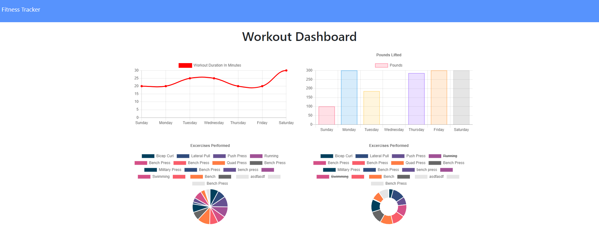

# Workout-Tracker

## Description

The Fitness Tracker app is designed to help people attain their fitness goals faster. They are able to track various exercises and see their statistics over time. 

## Table of Contents

- [Installation](#Installation)
- [Questions](#Questions)

## Deployed Link

[Check it out here]()

## Installation 

To install necessary dependencies, run the following command:

    npm i

## Questions

If you have any questions, please open an issue or contact me on GitHub at https://github.com/Bmcart3.

